# 河洛数字博物馆 · Heluo Digital Museum

> 把一件器物的纹理、尺度与故事，变成可以被重新发现的数字展览。

<p>
  <a href="https://heluo.pocketbay.app/"><strong>访问线上展厅 →</strong></a>
  ·
  <a href="https://github.com/diandian-dev-arch/heluo-digital-museum">查看 GitHub 仓库</a>
</p>

河洛数字博物馆是一个面向年轻文化探索者的双语数字博物馆：从馆藏检索、策展式阅读，到可交互的 3D 展厅与线下预约，用户可以先在线建立兴趣，再决定下一次真实到访。

<p>
  
  
  
  
</p>

## 线上体验

线上版本：**[https://heluo.pocketbay.app/](https://heluo.pocketbay.app/)**

建议从以下路径开始：

1. 在 **Explore / 探索馆藏** 中浏览器物、主题和双语摘要；
2. 打开 **3D Gallery / 数字展厅**，切换视角并观察器物细节；
3. 通过 **Visit Booking / 预约参观** 查看参观信息和可用时段。

## 页面掠影

深色展馆中的暖金灯光，让器物成为视觉中心。以下图片于 **2026-09-27 从线上网站重新采集**，以深色与英文界面为主，保留中文浅色作为对照，并展示真实登录后的商城与后台工作台。采用 1440 / 1680 像素宽的完整桌面页面，已关闭平台反馈广告；点击图片查看原尺寸。[截图来源与采集说明](docs/showcase/SOURCES.md)。

### One object, a living story · 英文深色首页

[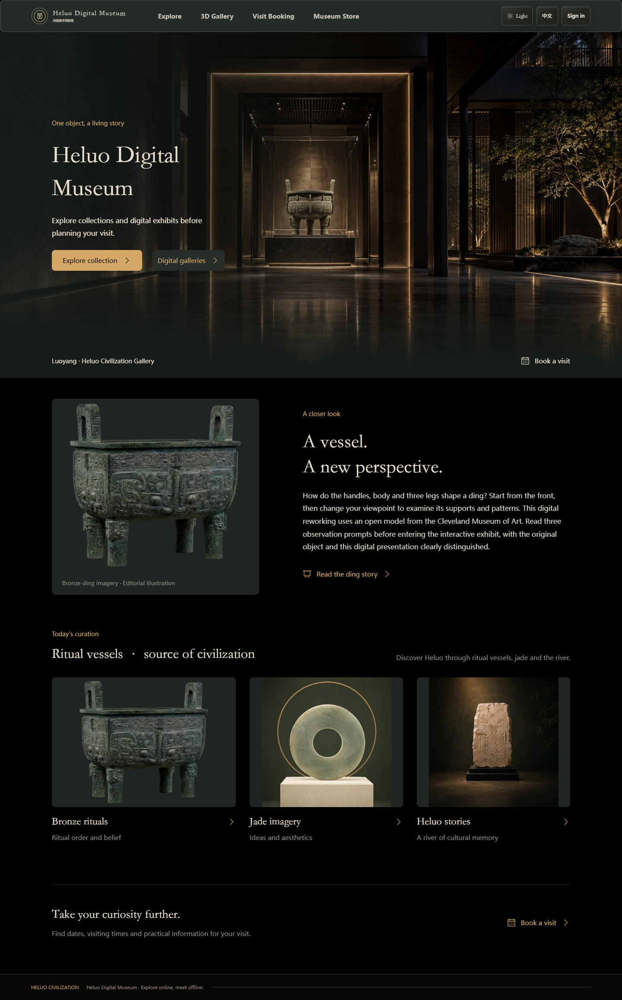](docs/showcase/home-dark-en.png)

### 同一座展馆，两种光线

<table>
  <tr>
    <td width="50%" align="center"><strong>首页 · 中文浅色</strong></td>
    <td width="50%" align="center"><strong>首页 · 中文深色</strong></td>
  </tr>
  <tr>
    <td width="50%"><a href="docs/showcase/home-light-zh.png">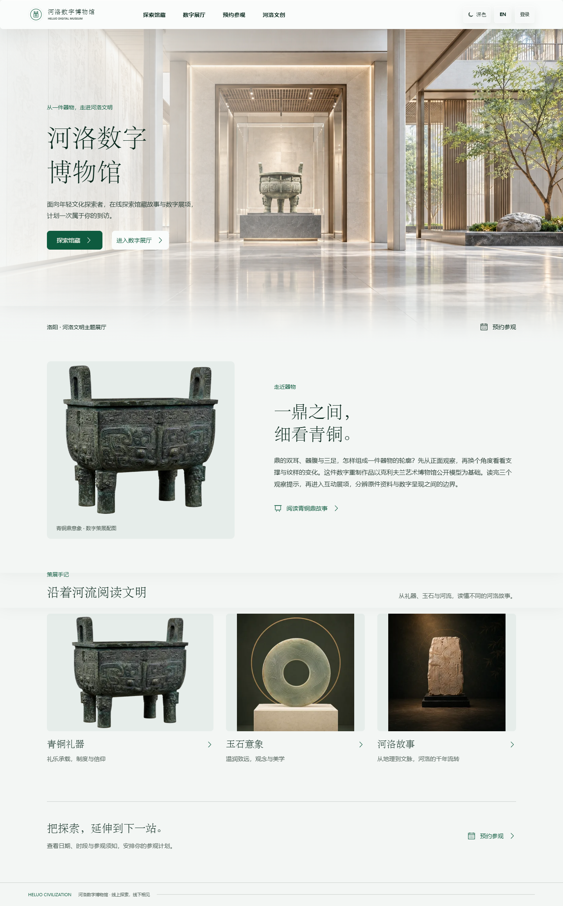</a></td>
    <td width="50%"><a href="docs/showcase/home-dark-zh.png">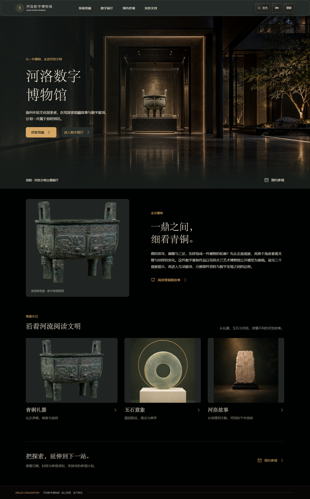</a></td>
  </tr>
  <tr>
    <td colspan="2" align="center"><sub>中文浅色与深色 · 从顶部展廊到页尾的完整对照</sub></td>
  </tr>
</table>

### Explore · 英文深色馆藏

从六件器物，到主题线索与延伸阅读，让浏览形成一条自然的发现路径。部分尚无译文的内容保留中文回退。

[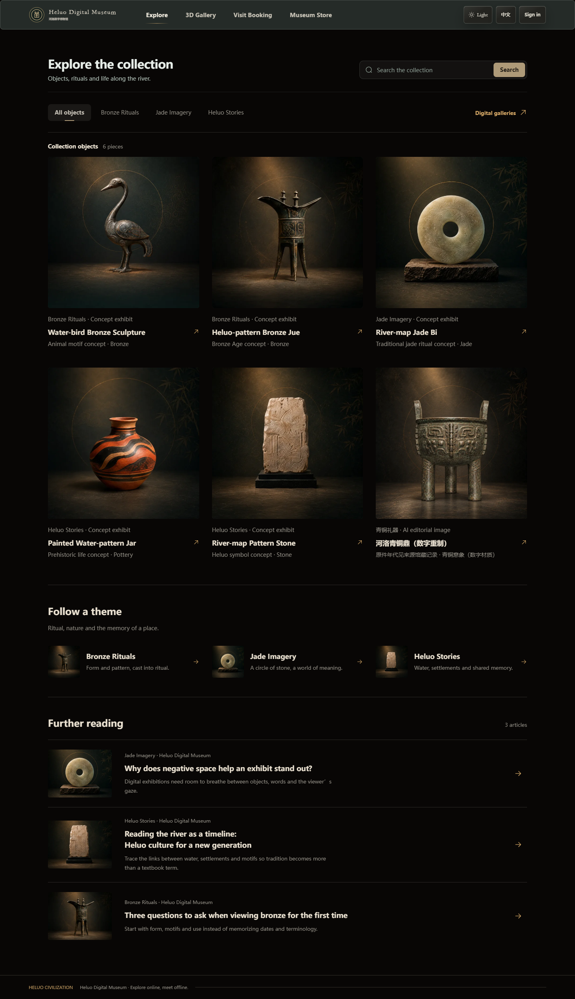](docs/showcase/explore-dark-en.png)

### Museum Store · 英文深色文创商城

把器物纹样带进日常：茶具、织物与文具，在统一的深色界面中呈现。

[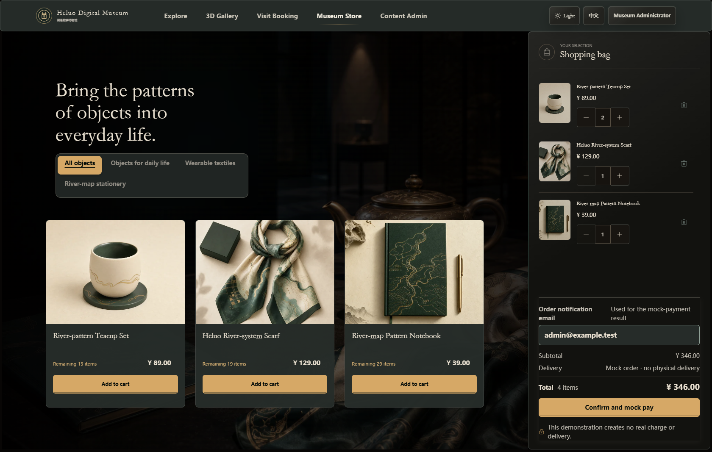](docs/showcase/shop-dark-en.png)

### 3D Gallery · 让器物来到眼前

真实加载的青铜鼎模型，配合多视角控件、器物来源与展项说明，呈现从浏览到近观的体验。

[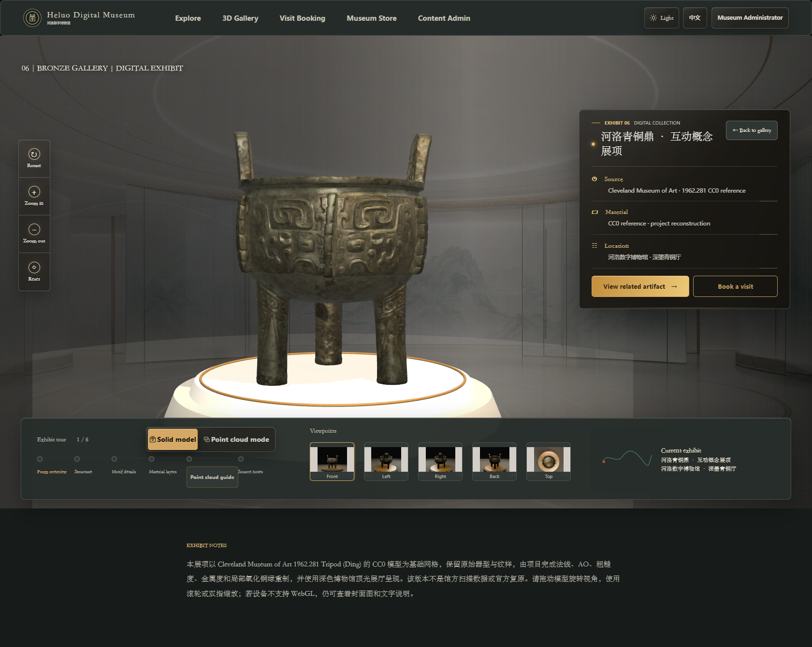](docs/showcase/digital-exhibit-dark-en.png)

<details>
<summary>展开查看：英文深色展厅入口与预约完整页面</summary>

[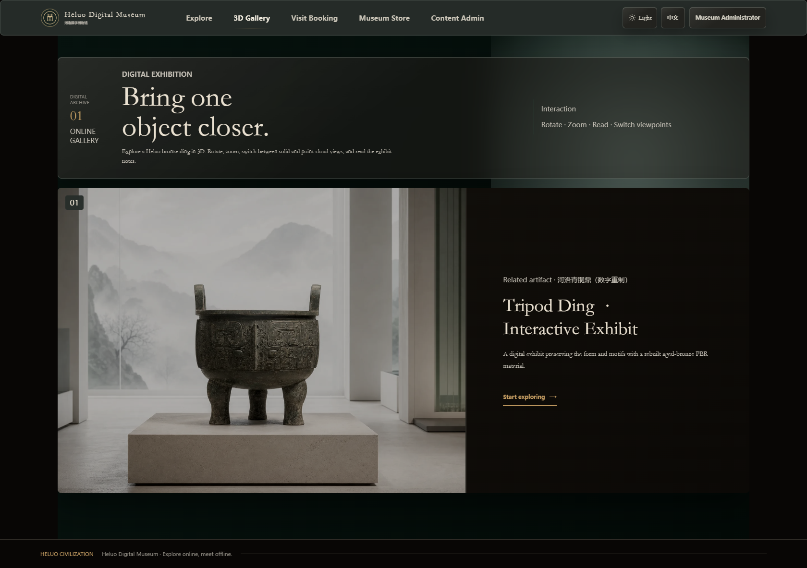](docs/showcase/gallery-dark-en.png)

[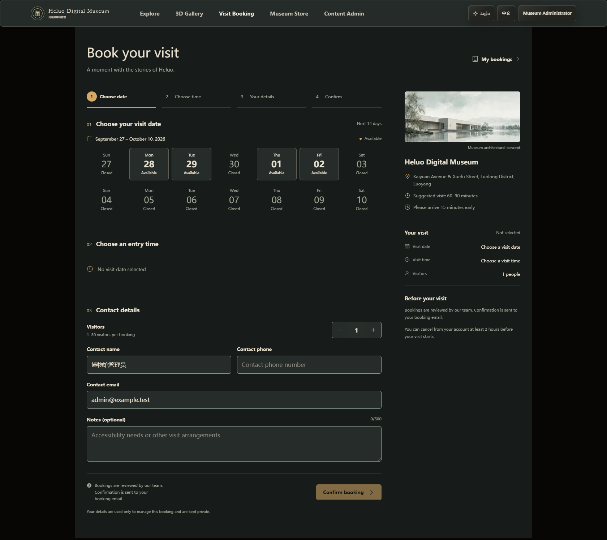](docs/showcase/booking-dark-en.png)

</details>

### Behind the scenes · 后台管理工作台

前台负责讲故事，后台负责让内容持续更新。以下为管理员登录后的线上实页，展示内容编辑、发布状态、商品库存与 3D 展项管理。后台当前以中文为主。

<table>
  <tr><td width="50%" align="center"><strong>内容管理 · 深色</strong></td><td width="50%" align="center"><strong>内容管理 · 浅色</strong></td></tr>
  <tr>
    <td><a href="docs/showcase/admin-content-dark-zh.png">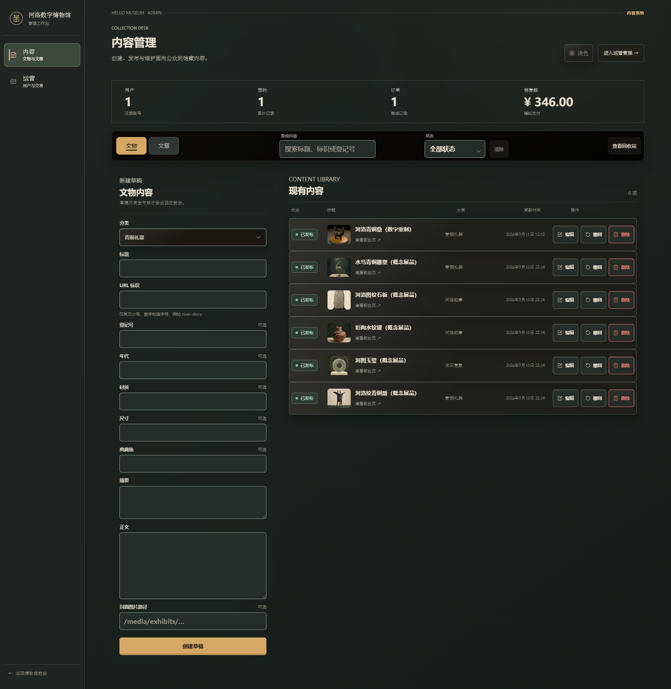</a></td>
    <td><a href="docs/showcase/admin-content-light-zh.png">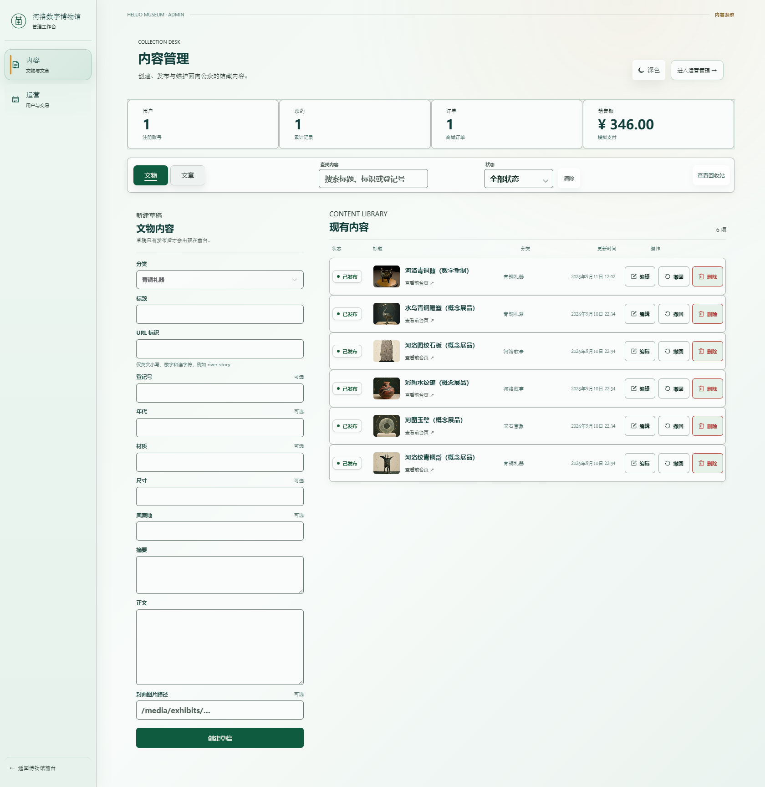</a></td>
  </tr>
</table>

**商品运营 · 深色**

[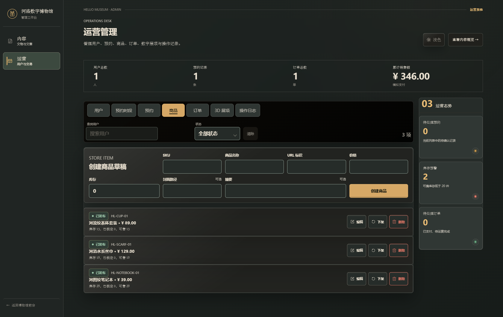](docs/showcase/admin-products-dark-zh.png)

<details>
<summary>展开查看：深色 3D 展项管理</summary>

[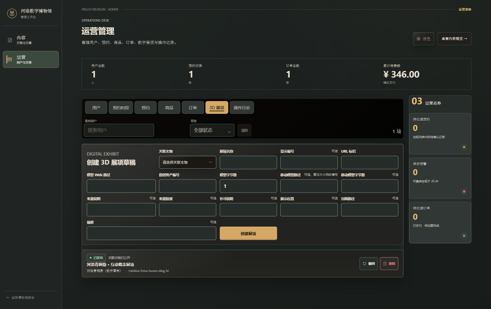](docs/showcase/admin-exhibits-dark-zh.png)

</details>

## 当前实现

- 前台：馆藏/文章分类浏览、关键词搜索、详情、3D 展厅、预约、注册登录、个人中心、购物车、订单和模拟支付。
- 后台：内容、3D 展项、用户、预约时段与预约、商品、订单、基础统计和操作日志。
- 技术：Vue 3 + TypeScript + Vite、Spring Boot 3（Java 17）、MySQL 8、Flyway、Docker Compose。
- 第一版边界：仅模拟支付；管理员不能公开注册；邮件在本地环境记录为开发邮件日志。

## 项目亮点

- **双语探索**：中文与英文标题、摘要统一进入搜索链路，界面语言切换后仍能连续发现内容。
- **策展式叙事**：主页、Explore 和详情页以器物、主题路径和河洛文化线索组织内容，而不是简单的后台列表。
- **可交互 3D 展厅**：支持模型旋转、缩放、视角切换，并为 WebGL 不可用或移动端场景准备了降级体验。
- **从线上到线下**：浏览馆藏、预约参观、文创商城与模拟支付组成一条完整体验路径。
- **可运营后台**：内容、展项、商品、预约、订单、统计与操作日志均有对应管理能力。

> 本项目为课程演示，商城仅模拟支付。内容包含概念展品与数字重制；部分模型基于 Cleveland Museum of Art 的 CC0 开放资源，具体来源以资产台账和展项说明为准。正式展示前需要核对史实文案和资产授权。

## 本地启动（推荐）

前提：Docker Desktop 已启动。

```powershell
Set-Location "C:\Users\Jie\Documents\博物馆"
Copy-Item "deploy\.env.example" "deploy\.env"
docker compose --env-file deploy\.env -f deploy\compose.yaml up --build -d
docker compose --env-file deploy\.env -f deploy\compose.yaml ps
```

访问：

- 前台：<http://localhost:8088>
- 健康检查：<http://localhost:8088/api/v1/health>

管理员初始化信息由本机 `deploy\.env` 中的 `MUSEUM_BOOTSTRAP_ADMIN_*` 配置决定；该文件被 Git 忽略，不能提交。

停止服务：

```powershell
docker compose --env-file deploy\.env -f deploy\compose.yaml down
```

## 本地开发与检查

```powershell
# 前端
Set-Location frontend
pnpm install
pnpm typecheck
pnpm test
pnpm build

# 后端
Set-Location ..\backend
mvn test
```

## 项目文档

- [项目状态与下一步](PROJECT_STATUS.md)
- [需求追踪表](docs/01-requirements-traceability.md)
- [数据模型与权限](docs/04-data-and-permissions.md)
- [API 契约](docs/05-api-design.md)
- [测试与验收计划](docs/06-test-plan.md)

未经用户确认，不提交或推送本项目的 Git 变更。
