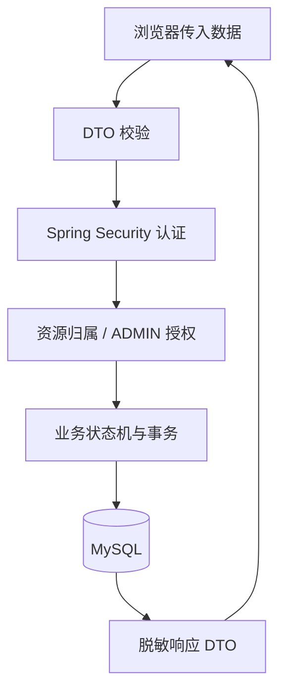

# 系统架构

- 文档版本：v1.0
- 最后更新：2026-08-01
- 技术决策：[ADR-001](decisions/ADR-001-tech-stack.md)、[ADR-002](decisions/ADR-002-payment-mode.md)、[ADR-003](decisions/ADR-003-content-soft-deletion.md)。

## 1. 架构目标

在课程项目规模内实现前后端分离、权限可靠、数据可迁移、可测试和可容器化的数字博物馆。用户先线上探索内容和自创 3D 展项，再预约线下参观或购买文创；后台由唯一管理员运营。

## 2. 系统全景

```mermaid
flowchart LR
  U["游客 / 用户 / 管理员"] --> FE["Vue 3 前端\n公开站点 + 管理后台"]
  FE -->|"HTTPS / REST /api/v1"| BE["Spring Boot 3 后端"]
  BE --> DB[("MySQL 8\n业务数据 + Flyway")]
  BE --> CACHE["Redis\n可选：缓存/限流")]
  BE --> MAIL["SMTP 邮件服务\n找回密码、预约、订单状态")]
  FE --> ASSET["自创 Web 资源\n图片 + GLB 模型")]
  BE --> LOG["操作日志 / 健康检查 / OpenAPI"]
```

> Redis 是性能与限流的后续能力，不是第一版功能完成的前置条件。真实支付、短信、物流和第三方登录均不在第一版范围内。

## 3. 前端架构

| 层 | 职责 |
|---|---|
| 公开前台 | 首页、内容、搜索、3D 展厅、预约、商城、订单、个人中心和中英文切换。 |
| 管理后台 | 内容、3D 展项、预约时段、预约、商品、订单、普通用户、统计和操作日志。 |
| 路由与状态 | Vue Router 做体验层路由守卫；Pinia 保存登录状态和页面共享状态。 |
| API 客户端 | 统一附加认证头、请求 ID、错误映射、401 退出处理和支付幂等键。 |
| 3D 模块 | Three.js 只加载后端允许公开的 GLB/GLTF URL；离开页面释放场景资源。 |
| 资源层 | 自创图片与模型按资产编号登记；源文件不作为公开下载资源。 |

## 4. 后端模块边界

```text
auth          注册、登录、令牌、密码重置、个人资料
content       分类、文物、文章、3D 展项、发布、撤回、回收站
appointment   时段、名额、预约、状态变更、预约邮件
commerce      商品、购物车、订单、库存锁定、模拟支付、订单邮件
admin         后台用户状态、仪表盘、操作日志
common        响应信封、异常、验证、审计、配置、健康检查
```

模块之间通过服务层调用；Controller 不直接访问数据库，不把权限判断只放在前端，不在业务代码中硬编码环境凭据。

## 5. 数据与状态边界

- MySQL 是用户、内容、预约、订单、库存和审计数据的唯一业务事实来源。
- 数据表、外键、索引和状态机以 [`04-data-and-permissions.md`](04-data-and-permissions.md) 与 [`07-er-diagram.md`](07-er-diagram.md) 为准。
- 内容与商品删除采用软删除；历史预约和订单使用状态保留，不物理删除。
- 订单创建锁定库存，支付成功正式扣减；相同幂等键的重复支付不能重复扣库存。
- 前台公开查询严格过滤发布状态、上架状态与软删除状态。

## 6. 安全边界



- 密码仅存 BCrypt 哈希；认证失败统一提示，不枚举账号。
- 所有“我的预约/订单”后端强制加当前 `userId` 条件；管理员访问要求 `ADMIN`。
- 写操作校验输入、状态和资源归属；关键后台操作写入审计日志。
- 令牌、SMTP、数据库等机密只来自环境变量；`.env` 不进入 Git。
- 密码找回、预约确认、支付成功邮件都经 SMTP 边界发送；投递失败记录结果，但不回滚已经成功的业务状态。

## 7. 资源与 3D 资产流程

```text
自创源文件（图片工程 / Blender .blend）
→ 项目资产清单（Markdown/表格 + 资产逻辑编号）
→ Web 导出文件（优化图片 / GLB）
→ 后台记录 URL 与 asset_ref/model_source_ref
→ 前台按已发布状态加载
→ 浏览器验收加载、交互、失败降级与资源释放
```

当前自创资产目录为 `assets/`；其中 `source/` 是源文件，`export/` 或图片目录是前台候选资源。工程接入前必须继续做图片 Web 优化、GLB 浏览器加载和版权/来源登记验收。

## 8. 部署拓扑与配置

```text
Docker Compose
├─ frontend：构建后的 Web 静态服务
├─ backend：Spring Boot API
├─ mysql：持久化卷 + Flyway 迁移
├─ redis：可选缓存/限流服务
└─ mail：开发环境测试邮件工具或外部 SMTP 配置
```

生产/演示验收不能只运行 `docker compose config --quiet`；还必须检查容器状态、后端健康端点、迁移结果、前端访问和关键用户路径。

## 9. 可观测性与质量

- 每个 API 响应携带 `requestId`，日志使用该 ID 串联排查。
- 后端提供健康检查；管理员操作、状态变更、库存与支付处理均记录操作日志。
- 构建门禁：前端类型检查、测试、构建；后端测试；Compose 配置和运行状态检查。
- 性能指标以课程确认的 N-04 数值为准；在压测脚本与报告落地前不宣称达到高并发目标。
