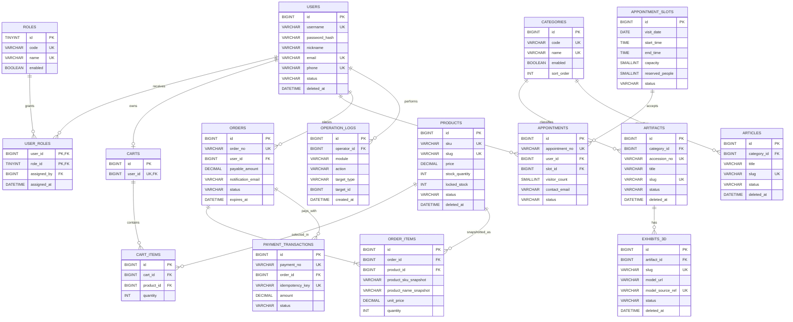

# 完整 ER 图与数据关系说明

- 文档版本：v0.1
- 最后更新：2026-08-01
- 权威字段定义：[`04-data-and-permissions.md`](04-data-and-permissions.md)
- 范围：用户权限、内容、预约、商城订单与操作日志的第一版逻辑模型。
- 不包含：真实支付平台回调、物流、短信、独立媒体资源表和后续多管理员扩展。

## 1. 如何阅读

- `PK` 是主键，`FK` 是外键，`UK` 是唯一约束。
- 为保证图可读性，只显示主键、主要外键和业务关键字段；完整字段、索引和状态规则以 `04-data-and-permissions.md` 为准。
- `created_by`、`updated_by`、`deleted_by`、`status_updated_by` 等所有审计操作人字段均关联 `users.id`，在图中不重复绘制。

## 2. 第一版完整 ER 图



## 3. 关键关系解释

| 关系 | 说明 | 第一版规则 |
|---|---|---|
| `users ↔ roles` | 通过 `user_roles` 多对多关联。 | 数据模型支持扩展；业务规则只启用一个 `ADMIN`，其余账号为 `USER`。 |
| `categories → artifacts/articles` | 一个一级分类可包含多条文物和文章。 | 内容各自只属于一个一级分类；已被引用的分类仅能停用。 |
| `artifacts → exhibits_3d` | 一个文物可关联多个自创 3D 展项。 | 第一版至少发布一个可加载的自创模型。 |
| `appointment_slots → appointments` | 一个时段可容纳多个预约。 | 默认 30 人、2 小时、开放未来 14 天；`reserved_people` 防止超额预约。 |
| `users → carts → cart_items` | 一个用户最多一个活动购物车。 | 同一商品在购物车中只能一条，数量累加。 |
| `users → orders → order_items` | 一个用户可创建多个订单。 | 订单明细保存商品名称、价格、封面等快照。 |
| `products → order_items` | 历史订单仍保留与原商品的关联。 | 商品下架/软删除不会改变历史订单快照。 |
| `orders → payment_transactions` | 一个订单可以产生多次支付尝试。 | `idempotency_key` 保证同一模拟支付请求不重复扣库存。 |
| `users → operation_logs` | 管理员关键操作可追溯。 | 内容发布/删除恢复、预约处理、库存/订单状态变更均需要记录。 |

## 4. 关键查询边界

```text
公开内容：PUBLISHED + deleted_at IS NULL
公开商品：ON_SHELF + deleted_at IS NULL
我的预约：appointments.user_id = 当前登录用户
我的订单：orders.user_id = 当前登录用户
后台管理：当前登录用户拥有 ADMIN 角色
```

## 5. 状态机汇总

```text
内容：DRAFT → PUBLISHED → WITHDRAWN；软删除后恢复为 WITHDRAWN
预约：PENDING → CONFIRMED / CANCELLED；CONFIRMED → COMPLETED / CANCELLED
订单：PENDING_PAYMENT → PAID / CANCELLED；PAID → COMPLETED
商品：ON_SHELF ↔ OFF_SHELF；删除采用软删除
支付：INITIATED → SUCCEEDED / FAILED
```

## 6. ER 图验收清单

- [x] 覆盖用户、角色、内容、预约、商城、订单、支付和审计日志。
- [x] 每个核心业务表都有主键，关系均可通过外键表达。
- [x] 用户个人数据均通过 `user_id` 归属校验。
- [x] 历史订单通过快照字段避免受商品变更影响。
- [x] 状态、软删除和库存锁定规则与数据模型文档一致。
- [ ] 后续根据 API 契约核对每个接口需要的分页、筛选和排序索引。
